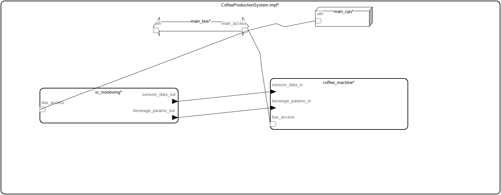
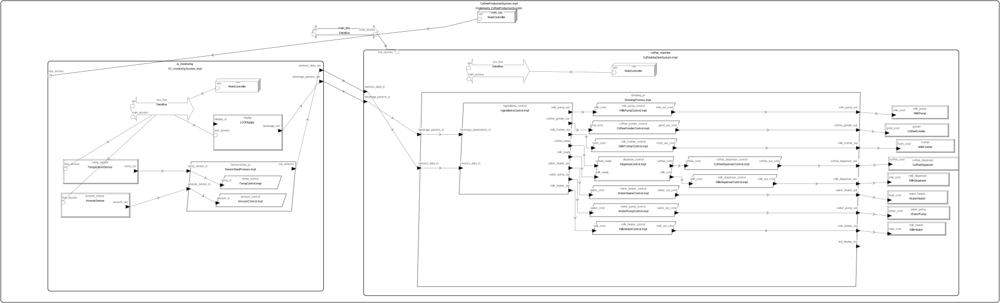
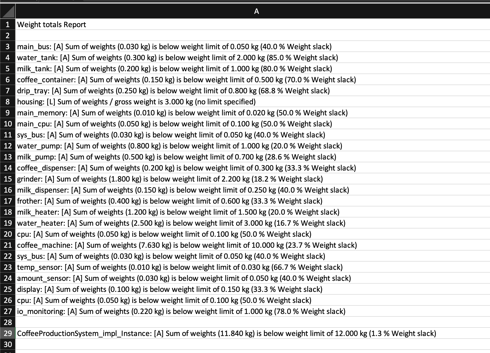

# Coffee Machine – Real-Time System Design in AADL

## Authors

- Bartosz Warchoł, bwarchol@student.agh.edu.pl  
- Piotr Waluszek, waluszekp@student.agh.edu.pl

## Project Description

The coffee machine is a real-time system designed in the AADL language, aimed at enabling the user to prepare various types of coffee. The system manages the intake of water, coffee, and milk, the milk frothing process, grinding coffee beans, and temperature control.

### Project Goals

The main objective of this project was to model a coffee machine system using AADL to demonstrate:
- Component-based architecture design for embedded systems
- Real-time system modeling with proper separation of hardware and software components
- Weight analysis and resource management in AADL
- Integration of sensors, actuators, and control logic

### System Architecture

The system is organized into three main levels:
1. **Top-level system** (`CoffeeProductionSystem`) - coordinates the entire coffee making process
2. **Coffee Machine subsystem** (`CoffeeMachineSystem`) - handles the actual beverage preparation including heating, grinding, and dispensing
3. **I/O Monitoring subsystem** (`IO_monitoringSystem`) - manages user interface and sensor data acquisition

Each subsystem has its own processor and local bus, connected through a main system bus. This modular approach allows for independent development and testing of subsystems while maintaining clear interfaces between components.

### Key Functionalities

The coffee machine supports preparation of three main beverage types (espresso, latte, cappuccino) with customizable parameters. The system monitors critical parameters such as water and milk levels, temperature, and coffee amount to ensure safe and proper operation. All actuators (pumps, heaters, grinder, frother) are controlled through dedicated threads that process sensor data and execute brewing sequences.

The AADL model includes weight properties for all physical components, ensuring the final design meets the 12 kg weight constraint with appropriate safety margins.

## System Components

### Package

- **CoffeeMachine** – the main package integrating all system components.

### Main Systems
| System Name               | Description                                     |
|--------------------------|--------------------------------------------------|
| `CoffeeProductionSystem` | Top-level system integrating all subsystems     |
| `CoffeeMachineSystem`    | Subsystem: Handles coffee production and brewing           |
| `IO_monitoringSystem`    | Subsystem: Manages sensors and user interface              |

### Processors
| Processor Name    | Description                              | System                   |
|------------------|------------------------------------------|--------------------------|
| `MainController` | Main CPU for CoffeeMachineSystem         | CoffeeMachineSystem     |
| `IOController` | Main CPU for IO_monitoringSystem         | IO_monitoringSystem     |
| `BrewingController` | Top-level CPU for overall coordination   | CoffeeProductionSystem  |

### Buses
| Bus Name    | Description                                          |
|-------------|------------------------------------------------------|
| `MainDataBus`   | Main system bus connecting components                |
| `DataBusBrewing`   | Local bus for CoffeeMachineSystem                   |
| `DataBusIO`   | Local bus for IO_monitoringSystem                   |

### Memory
| Memory Name     | Description                                     |
|-----------------|------------------------------------------------|
| `SystemMemory`  | Shared memory for all system components         |

## Devices

| Device              | Description                          |
|---------------------|--------------------------------------|
| `AmountSensor`      | Measures coffee quantity.            |
| `TemperatureSensor` | Measures temperature.                |
| `WaterPump`         | Controls water flow.                 |
| `MilkPump`          | Controls milk flow.                  |
| `CoffeeDispenser`   | Dispenses brewed coffee.             |
| `CoffeeGrinder`     | Activates the coffee grinder.        |
| `MilkDispenser`     | Dispenses milk.                      |
| `MilkFrother`       | Froths the milk.                     |
| `WaterHeater`       | Heats water.                         |
| `MilkHeater`        | Heats milk.                          |
| `LCDDisplay`        | Displays messages to the user.       |

## Threads

| Thread                   | Description                                                    |
|--------------------------|----------------------------------------------------------------|
| `AmountControl`          | Processes data from `AmountSensor`.                            |
| `TempControl`            | Processes data from `TemperatureSensor`.                       |
| `WaterPumpControl`       | Controls the `WaterPump`.                                      |
| `MilkPumpControl`        | Controls the `MilkPump`.                                       |
| `WaterHeaterControl`     | Controls the `WaterHeater`.                                    |
| `MilkHeaterControl`      | Controls the `MilkHeater`.                                     |
| `CoffeeDispenserControl` | Controls the `CoffeeDispenser`.                                |
| `CoffeeGrinderControl`   | Controls the `CoffeeGrinder`.                                  |
| `MilkDispenserControl`   | Controls the `MilkDispenser`.                                  |
| `MilkFrotherControl`     | Controls the `MilkFrother`.                                    |
| `IngredientsControl`     | Maps beverage requirements to actuator commands.               |
| `DispenseControl`        | Coordinates final dispensing of milk and coffee.               |
| `BrewingControl`         | Handles top-level beverage preparation and display output.     |
| `TemperatureControl`     | Periodically evaluates and controls temperature regulation.     |

## Processes

| Process              | Role                                     |
|----------------------|------------------------------------------|
| `SensorDataProcess`  | Acquires and formats sensor input.       |
| `BrewingProcess`     | Main logic for coffee beverage preparation. |

## System Features

- **Support for multiple beverage types** – espresso, latte, cappuccino, and customizable strength and milk foam density.
- **Parameter personalization** – water amount, coffee amount, milk amount, temperature, frothing option, coffee strength, foam density.
- **Monitoring** – water level, milk level, temperature.

## Images

### System Overview

*High-level architecture diagram showing main system components and their interactions*

### Detailed System Architecture

*Detailed view of all system components including threads, processes, buses, and data flows*

## Weight Analysis

The following image shows the weight totals report for the coffee machine system components. The analysis confirms that the sum of weights for the `CoffeeProductionSystem_impl_Instance` (11.840 kg) is below the specified weight limit of 12.000 kg, with a 1.3% weight slack. All individual components are also within their respective weight limits.

A detailed breakdown of the weight analysis is provided in the table below:

| Component Name                            | Actual Weight (kg) | Weight Limit (kg) | Weight Slack (%) |
|-------------------------------------------|--------------------|-------------------|------------------|
| `main_bus`                                | 0.030              | 0.050             | 40.0             |
| `water_tank`                              | 0.300              | 2.000             | 85.0             |
| `milk_tank`                               | 0.200              | 1.000             | 80.0             |
| `coffee_container`                        | 0.150              | 0.500             | 70.0             |
| `drip_tray`                               | 0.250              | 0.800             | 68.8             |
| `housing`                                 | 3.000              | N/A               | N/A              |
| `main_memory`                             | 0.010              | 0.020             | 50.0             |
| `main_cpu`                                | 0.050              | 0.100             | 50.0             |
| `sys_bus` (within `CoffeeMachineSystem`)   | 0.030              | 0.050             | 40.0             |
| `water_pump`                              | 0.800              | 1.000             | 20.0             |
| `milk_pump`                               | 0.500              | 0.700             | 28.6             |
| `coffee_dispenser`                        | 0.200              | 0.300             | 33.3             |
| `grinder`                                 | 1.800              | 2.200             | 18.2             |
| `milk_dispenser`                          | 0.150              | 0.250             | 40.0             |
| `frother`                                 | 0.400              | 0.600             | 33.3             |
| `milk_heater`                             | 1.200              | 1.500             | 20.0             |
| `water_heater`                            | 2.500              | 3.000             | 16.7             |
| `cpu` (within `CoffeeMachineSystem`)      | 0.050              | 0.100             | 50.0             |
| `coffee_machine` (System Instance)        | 7.630              | 10.000            | 23.7             |
| `sys_bus` (within `IO_monitoringSystem`)   | 0.030              | 0.050             | 40.0             |
| `temp_sensor`                             | 0.010              | 0.030             | 66.7             |
| `amount_sensor`                           | 0.030              | 0.050             | 40.0             |
| `display`                                 | 0.100              | 0.150             | 33.3             |
| `cpu` (within `IO_monitoringSystem`)      | 0.050              | 0.100             | 50.0             |
| `io_monitoring` (System Instance)         | 0.220              | 1.000             | 78.0             |
| **`CoffeeProductionSystem_impl_Instance`**| **11.840**         | **12.000**        | **1.3**          |


In the table above:
-   **`coffee_machine`**: This refers to an instance of the `CoffeeMachineSystem.impl`. It represents the core subsystem responsible for the actual coffee brewing process, including components like the water pump, milk pump, grinder, heaters, and their associated control logic and CPU. Its calculated weight is 7.630 kg, well within its defined limit of 10.000 kg.
-   **`CoffeeProductionSystem_impl_Instance`**: This is the top-level instance representing the entire assembled coffee maker. It encompasses the `coffee_machine` subsystem, the `io_monitoring` subsystem (for sensors and display), shared components like the `main_bus`, `main_cpu`, and `main_memory`, as well as physical parts like the `water_tank`, `milk_tank`, `coffee_container`, `drip_tray`, and `housing`. The total weight of 11.840 kg for the entire system is the sum of all these constituent parts, and it successfully meets the overall system weight limit of 12.000 kg.



## Bibliography

[1] SAE International, "AS5506C: Architecture Analysis & Design Language (AADL)," SAE International Standard, 2017.

[2] P. H. Feiler and D. P. Gluch, *Model-Based Engineering with AADL: An Introduction to the SAE Architecture Analysis & Design Language*, Addison-Wesley Professional, 2012.

[3] J. Hugues and F. Singhoff, "Developing Critical Embedded Systems with AADL: A Practical Introduction," in *Embedded Real-Time Systems*, Wiley-ISTE, 2014.

[4] P. H. Feiler, D. P. Gluch, and J. J. Hudak, "The Architecture Analysis & Design Language (AADL): An Introduction," Technical Note CMU/SEI-2006-TN-011, Carnegie Mellon University, 2006.

## License

This project is licensed under the MIT License.

```
MIT License

Copyright (c) 2025 Bartosz Warchoł, Piotr Waluszek

Permission is hereby granted, free of charge, to any person obtaining a copy
of this software and associated documentation files (the "Software"), to deal
in the Software without restriction, including without limitation the rights
to use, copy, modify, merge, publish, distribute, sublicense, and/or sell
copies of the Software, and to permit persons to whom the Software is
furnished to do so, subject to the following conditions:

The above copyright notice and this permission notice shall be included in all
copies or substantial portions of the Software.

THE SOFTWARE IS PROVIDED "AS IS", WITHOUT WARRANTY OF ANY KIND, EXPRESS OR
IMPLIED, INCLUDING BUT NOT LIMITED TO THE WARRANTIES OF MERCHANTABILITY,
FITNESS FOR A PARTICULAR PURPOSE AND NONINFRINGEMENT. IN NO EVENT SHALL THE
AUTHORS OR COPYRIGHT HOLDERS BE LIABLE FOR ANY CLAIM, DAMAGES OR OTHER
LIABILITY, WHETHER IN AN ACTION OF CONTRACT, TORT OR OTHERWISE, ARISING FROM,
OUT OF OR IN CONNECTION WITH THE SOFTWARE OR THE USE OR OTHER DEALINGS IN THE
SOFTWARE.
```
